# Predicting 30-Day Hospital Readmission in Medicare Patients


> **TL;DR —** A reproducible supervised-ML pipeline that estimates the probability of **unplanned 30-day readmission at discharge** for Medicare-insured patients in **MIMIC-IV v3.1**. Starting from 244,576 Medicare admissions, we iteratively engineered seven dataset versions (V1 → V7), trained four gradient-boosting families plus deep-learning baselines, and deployed a single **XGBoost** model on **50 parsimonious features** that reaches **AUROC 0.793** — outperforming LACE by **+0.109** and ClinicalBERT by **+0.079** AUROC — with full **SHAP** interpretability for clinical decision support.

**Authors** · Armando Gonzalez (AI track) · Thiago Bandeira (Business Analytics track)
**Mentor** · Dr. Christian Poellabauer
**Institution** · Florida International University — M.S. in Data Science & Artificial Intelligence
**Date** · April 2026

---

## Table of Contents

- [Overview](#overview)
- [Research Questions](#research-questions)
- [Headline Results](#headline-results)
- [Dataset & Cohort](#dataset--cohort)
- [Exploratory Data Analysis](#exploratory-data-analysis)
- [Feature Engineering V1 → V7](#feature-engineering-v1--v7)
- [Methods](#methods)
- [Model Selection — Single XGBoost vs 4-GBM Blend](#model-selection--single-xgboost-vs-4-gbm-blend)
- [Benchmark Comparison](#benchmark-comparison)
- [SHAP Interpretability](#shap-interpretability)
- [Repository Structure](#repository-structure)
- [Reproducing the Pipeline](#reproducing-the-pipeline)
- [Obtaining the MIMIC-IV Dataset](#obtaining-the-mimic-iv-dataset)
- [Limitations](#limitations)
- [Future Work](#future-work)
- [Authors & Citation](#authors--citation)
- [License](#license)

---

## Overview

Thirty-day unplanned readmission is a CMS-penalized quality measure under the **Hospital Readmissions Reduction Program (HRRP)**, costing Medicare an estimated **$26 B per year**. Traditional clinical scores such as **LACE** (AUROC ≈ 0.684) and note-based deep-learning pipelines such as **ClinicalBERT** (AUROC ≈ 0.714) leave significant headroom on this task.

This capstone develops an interpretable, clinically deployable risk-assessment tool trained end-to-end on the **Medicare subset of MIMIC-IV v3.1** (244,576 admissions, 21.1 % positive rate). Every deliverable — cohort construction, feature engineering, model training, ensembling, and SHAP interpretation — is contained in a single top-level notebook: [`Capstone_Final_Notebook.ipynb`](Capstone_Final_Notebook.ipynb).

## Research Questions

| # | Question | Answer |
|---|----------|--------|
| **RQ1** | Which features are most predictive of 30-day readmission in Medicare beneficiaries? | 180-day LOS trend, DRG code, late-order rate, primary-diagnosis chapter, squared 6-month prior admissions, last DRG × disposition, and discharge location dominate SHAP attributions. A core set of 50 features captures **99.4 %** of the predictive signal of a 368-feature superset. |
| **RQ2** | Which modeling approach (statistical, boosting, deep learning, or ensemble) performs best? | A scipy-optimized blend of 4 GBMs reaches AUROC 0.795. A single **XGBoost** model reaches 0.793 — the 0.002 AUROC gap does not justify the 4× deployment complexity, so XGBoost is the deployed model. |
| **RQ3** | Can interpretable ML provide actionable insights for providers at discharge? | Yes — SHAP produces patient-level attributions that map directly to discharge-team interventions (LOS-trend escalation, disease-specific discharge bundles, complex-care enrolment, warm handoffs). |

## Headline Results

| Metric | Value | Notes |
|--------|------:|-------|
| **Test AUROC (XGBoost V7, deployed)** | **0.793** | 20 % held-out GroupShuffleSplit at `subject_id` |
| Test AUPRC | 0.522 | Informative given 21.1 % base rate |
| Brier score (XGBoost V7) | 0.149 | Well-calibrated in the 0.4–0.6 triage range |
| 4-GBM scipy-optimized blend AUROC | 0.795 | Benchmark ceiling (+0.002 over deployed) |
| Stability (mean ± std across 5 CV folds) | 0.7956 ± 0.0026 | Low variance across patient-grouped folds |
| Uplift vs LACE (van Walraven 2010) | **+0.109 AUROC** | +16 % relative improvement |
| Uplift vs ClinicalBERT (Huang 2020) | **+0.079 AUROC** | Achieved using only structured EHR data — no notes |
| Features / Train size / Test size | 50 / 195,385 / 49,191 | V7 parsimonious set |

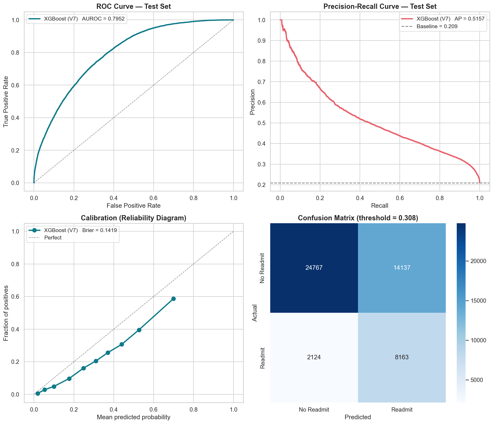

## Dataset & Cohort

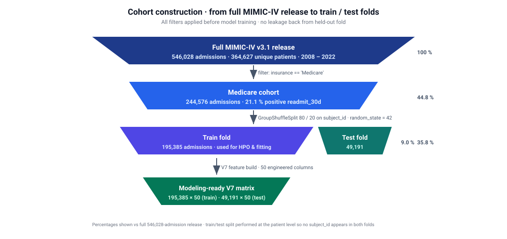

- **Source** — MIMIC-IV v3.1, released by the MIT Laboratory for Computational Physiology and Beth Israel Deaconess Medical Center via PhysioNet (credentialed access).
- **Full release** — 546,028 admissions · 364,627 unique patients · 2008 – 2022 · 300+ raw variables across administrative, pharmacy, laboratory, microbiology, vitals, procedure, diagnosis, and ICU tables.
- **Cohort** — Admissions where `insurance == 'Medicare'`, yielding **244,576 index admissions**.
- **Target** — `readmit_30d` computed strictly from admit / discharge timestamps available before discharge, preventing temporal leakage. Prevalence: **21.1 %**.
- **Splitting** — `GroupShuffleSplit` 80 / 20 on `subject_id` so no patient appears in both partitions.

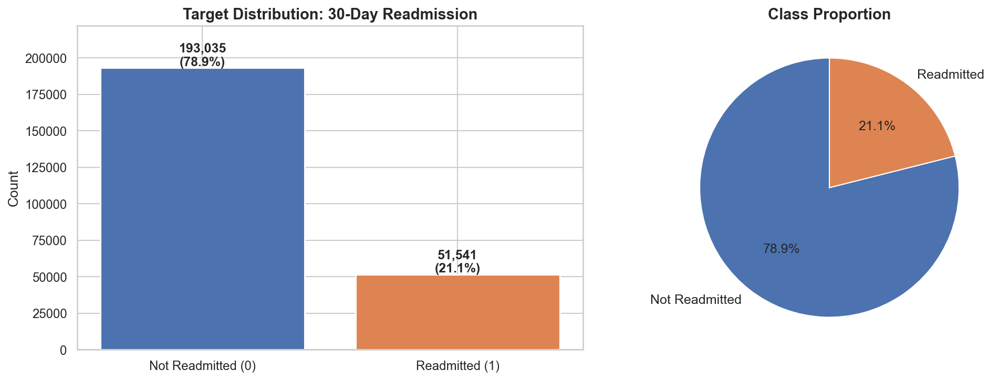

## Exploratory Data Analysis

### Discharge-destination stratification

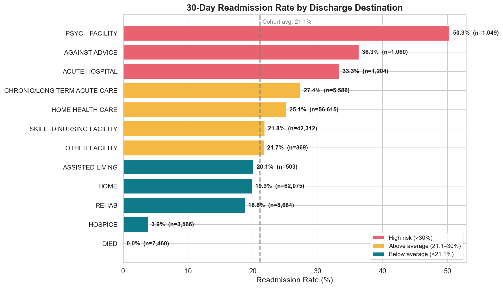

Readmission rates span **3.9 %** (Hospice) to **50.3 %** (Psychiatric facility) across the nine discharge destinations — the single strongest univariate signal in the dataset and a directly actionable lever for care-coordination teams. The ~56 K patients discharged to home health readmit at **25.1 %**, defining the largest intervenable cohort.

### DRG, comorbidity, and continuous-feature structure

<table>
<tr>
<td>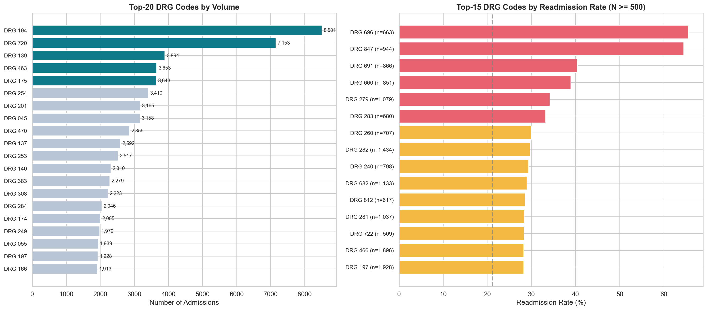</td>
<td>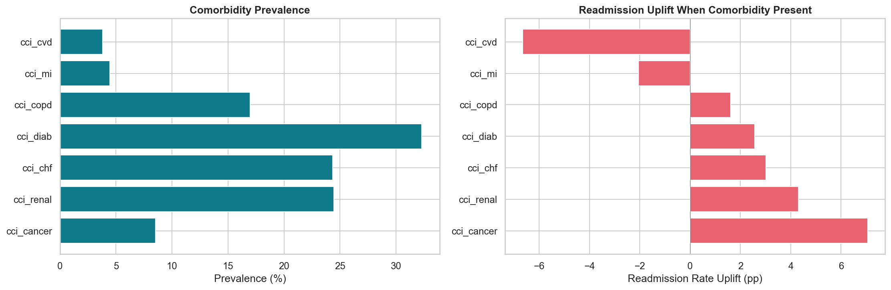</td>
</tr>
<tr>
<td align="center"><em>DRG-code readmission spread (11 % – 66 %)</em></td>
<td align="center"><em>CCI flag prevalence & readmission uplift</em></td>
</tr>
<tr>
<td>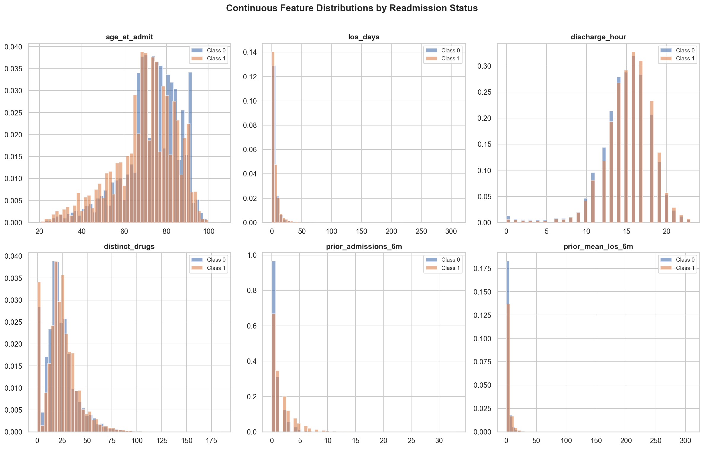</td>
<td>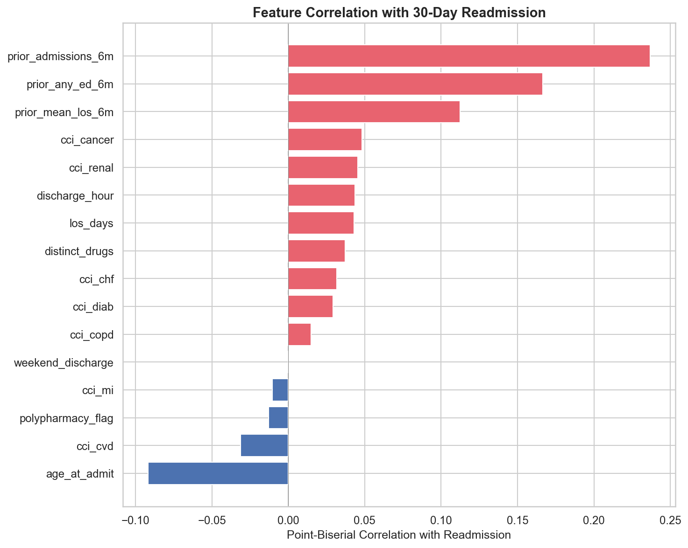</td>
</tr>
<tr>
<td align="center"><em>Age / LOS / medication-burden distributions by readmission status</em></td>
<td align="center"><em>Point-biserial correlations to the target</em></td>
</tr>
</table>

## Feature Engineering V1 → V7

Seven dataset versions were built incrementally so that the marginal contribution of each clinical domain can be measured independently of model choice.

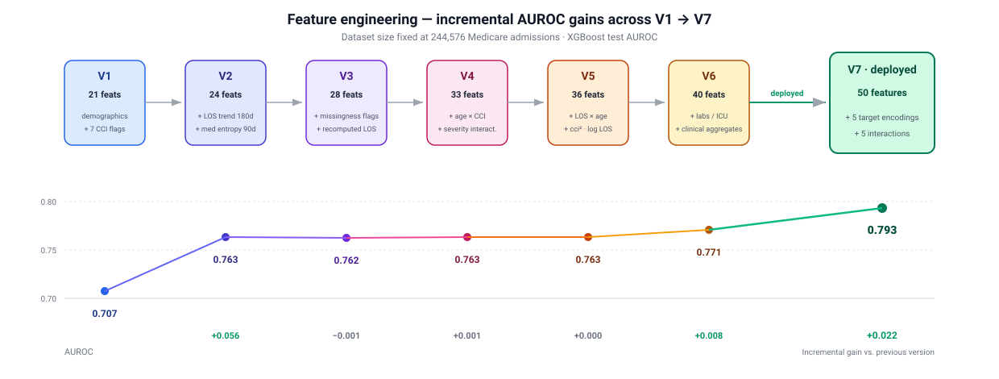

### Per-version AUROC progression (XGBoost)

| Version | # Features | New content | Test AUROC |
|---------|-----------:|-------------|-----------:|
| V1 | 21 | Demographics, admission type/location, 7 CCI flags, LOS, med burden, 6-month prior use, DRG | 0.707 |
| V2 | 24 | + last DRG × discharge disposition · 90-day medication entropy · 180-day LOS trend | **0.763** |
| V3 | 28 | + missingness flags · recomputed LOS | 0.762 |
| V4 | 33 | + age buckets · age × CCI · LOS × CCI · `cci_total` | 0.763 |
| V5 | 36 | + LOS × age · cci² · log1p(LOS) | 0.763 |
| V6 | 40 | + `n_diagnoses`, `n_procedures`, `n_labs_total`, `n_lab_item_types`, `n_labs_abnormal`, `icu_flag`, `icu_total_hrs`, `prior_admissions_all` | 0.771 |
| **V7** | **50** | **+ 5 target encodings + 5 clinical interactions** | **0.793** |
| Expanded | 368 | Unpruned superset: all pairwise interactions + extended encodings (exploration only) | 0.800 |

### Diminishing returns

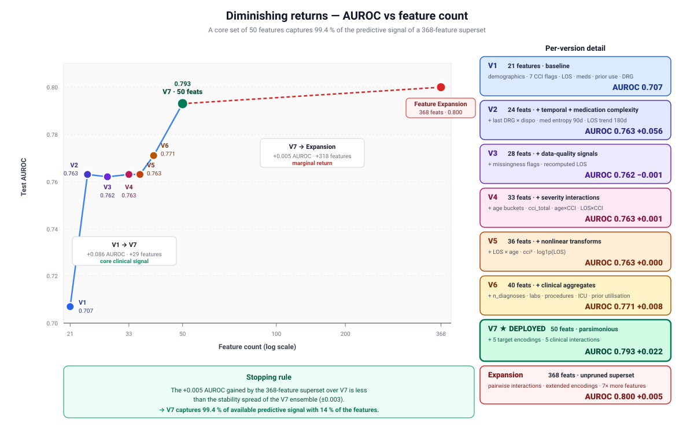

The two largest AUROC jumps occur at **V2** (+0.056, temporal + medication-complexity signals) and **V7** (+0.022, target encoding + clinical interactions). The 368-feature exploratory superset buys only **+0.005 AUROC** over V7, empirically justifying a parsimonious 50-feature model that captures **99.4 %** of the available signal at **~1⁄7 the feature count**.

## Methods

### Pipeline diagram

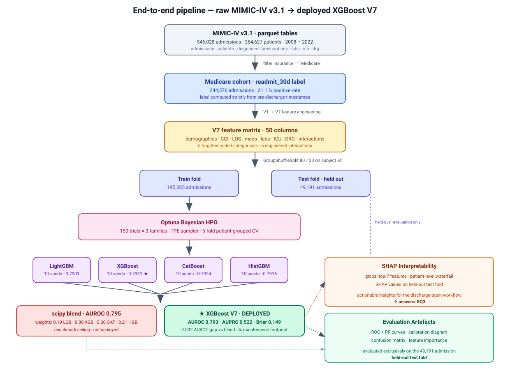

### Software stack

`Python 3.10` · `pandas` + `numpy` + `pyarrow` (parquet I/O) · `scikit-learn` (splits, preprocessing, baselines) · `LightGBM` · `XGBoost` · `CatBoost` · `HistGradientBoosting` · `PyTorch` (MLP / LSTM / GRU / FT-Transformer experiments) · `Optuna` (150-trial Bayesian HPO × 3 families) · `SHAP` (TreeExplainer) · `matplotlib` + `seaborn`.

### Train / test protocol

- **80 / 20 GroupShuffleSplit** on `subject_id` → zero patient overlap between train and test folds → unbiased generalization estimate.
- **Target encoding** with 5-fold out-of-fold cross-validation on high-cardinality categoricals (DRG, primary-Dx chapter, discharge location) to prevent leakage. CatBoost handles categoricals natively and skips this step.
- **Missingness** is absorbed by the histogram-based tree learners; informative-missing flags (`drg_code_is_missing`, `discharge_location_is_missing`, `los_days_is_missing`) are added as features in V3.
- **10 random seeds per GBM family** with prediction averaging to reduce variance.

### Model families evaluated

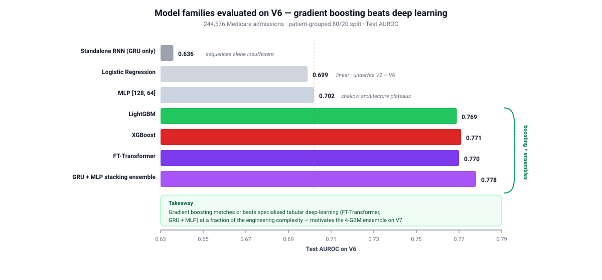

On V6, **gradient boosting matched or beat every deep-learning baseline tried** — a standard MLP trailed by > 0.06 AUROC, and specialized tabular architectures (**FT-Transformer** at 0.770 and a **GRU + MLP stacking ensemble with a logistic-regression meta-learner** at 0.778) failed to meaningfully surpass single-library boosting (LightGBM 0.769 / XGBoost 0.771) at a small fraction of the engineering complexity. This result — consistent with the tabular-deep-learning benchmarks of Gorishniy et al. (2021) — motivated the decision to build V7 around a 4-GBM ensemble.

<table>
<tr>
<td>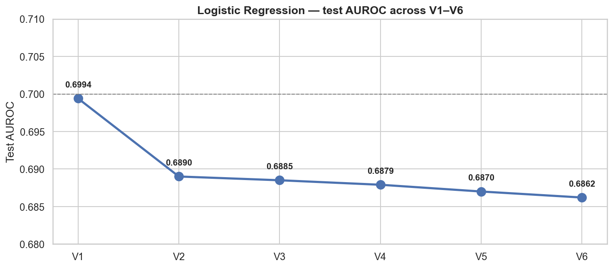</td>
<td>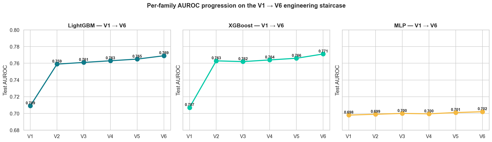</td>
</tr>
<tr>
<td align="center"><em>Logistic regression peaks at V1 then degrades — linear models underfit</em></td>
<td align="center"><em>LGBM and XGBoost scale to V6; MLP plateaus at ~0.70</em></td>
</tr>
</table>

## Model Selection — Single XGBoost vs 4-GBM Blend

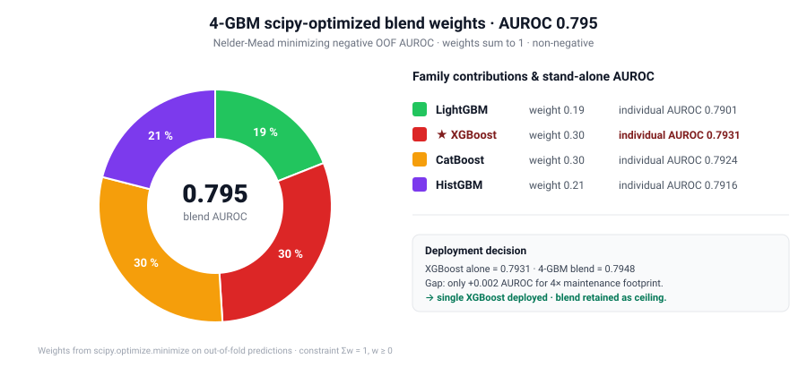

Each of the four GBM families was trained on V7 across **10 random seeds** and their OOF predictions averaged. A **`scipy.optimize.minimize` (Nelder-Mead)** call then searched for blend weights minimizing negative OOF AUROC subject to non-negativity and sum-to-one constraints.

Because the blend beats the best individual model by only **+0.002 AUROC** (0.7948 vs 0.7931), the single **XGBoost** model was selected as the deployment candidate — a 4× reduction in maintenance footprint at a negligible discrimination cost. The 4-GBM blend is retained in the report as the V7 discrimination ceiling.

## Benchmark Comparison

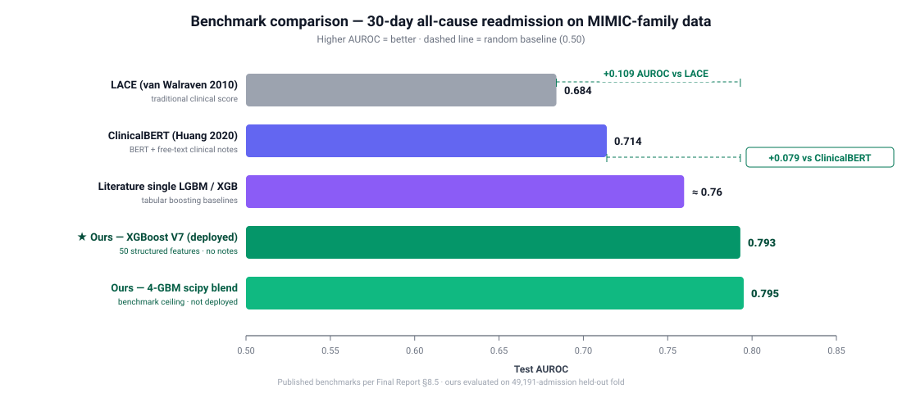

The deployed model **surpasses LACE by +0.109 AUROC** (a 16 % relative gain) and **exceeds ClinicalBERT by +0.079 AUROC** — all without using free-text clinical notes, imaging, or temporal graphs.

## SHAP Interpretability

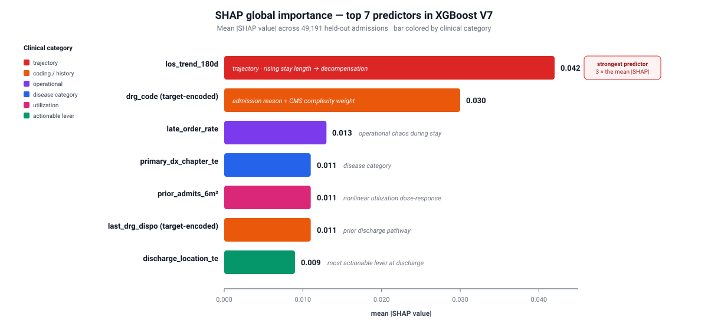

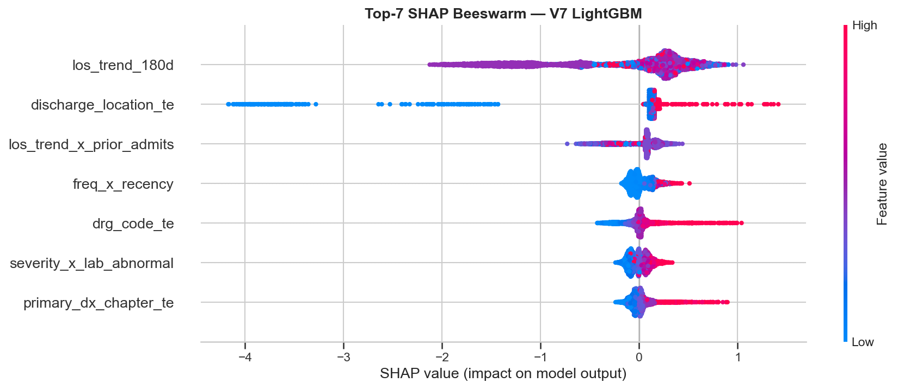

The top-7 predictors by mean-absolute SHAP value on the deployed XGBoost V7 model are:


| Rank | Feature | Mean \|SHAP\| | Clinical intuition |
|-----:|---------|-------------:|--------------------|
| 1 | `los_trend_180d` | 0.042 | Rising 6-month LOS trend is a compressed biomarker of disease-trajectory decompensation |
| 2 | `drg_code` (target-encoded) | 0.030 | Encodes both admission reason and CMS complexity weight |
| 3 | `late_order_rate` | 0.013 | Operational chaos during stay predicts post-discharge failure |
| 4 | `primary_dx_chapter_te` | 0.011 | Disease category shapes baseline risk profile |
| 5 | `prior_admits_6m_sq` | 0.011 | Nonlinear dose response — large jump from 3 → 4 prior admits |
| 6 | `last_drg_dispo` (target-encoded) | 0.011 | Prior discharge pathway predicts future readmission pattern |
| 7 | `discharge_location_te` | 0.009 | Most directly actionable feature — care team has full control at discharge |

SHAP produces **patient-level explanations**: each prediction decomposes into ranked, signed contributions from its top features, so a discharge team sees *which* risk drivers apply to *this individual* and can pair the score with targeted interventions (pre-discharge geriatric consultation, disease-specific bundles, pharmacist-led medication reconciliation, warm handoffs, complex-care enrolment).

## Repository Structure

```
Capstone Github/
├── README.md                            # this file
├── Capstone_Final_Notebook.ipynb        # end-to-end notebook — the primary deliverable
│
├── Report-Powerpoint/
│   ├── Medicare Capstone Final Report.pdf
│   └── Capstone Final Presentation.pptx
│
├── Dataset/                             # ⚠ GITIGNORED — not uploaded to GitHub (PhysioNet DUA)
│   └── mimic-parquet/                   #     populated locally by the user post-credentialing
│       ├── admissions.parquet           #     (see "Obtaining the MIMIC-IV Dataset")
│       ├── omr.parquet
│       └── training_table_v*.parquet
│
├── Final Model Results/
│   ├── model_v7_final_metrics.json      # AUROC / AUPRC / Brier / blend weights / stability
│   ├── v7_roc_pr_curves.png
│   ├── v7_calibration.png
│   ├── v7_confusion_matrix.png
│   ├── v7_feature_importance.{png,csv}
│   └── v7_shap_summary.png
│
├── training_table_v7.parquet            # deployed V7 feature matrix (50 cols)
├── v7_best_params.json                  # Optuna-tuned XGBoost hyperparameters
├── v7_split.npz                         # frozen train/test indices (reproducibility)
│
├── svg/                                 # scalable vector diagrams embedded in this README
│   ├── cohort_funnel.svg
│   ├── feature_progression.svg
│   ├── diminishing_returns.svg
│   ├── pipeline.svg
│   ├── model_families.svg
│   ├── blend_weights.svg
│   ├── benchmark_bars.svg
│   └── shap_top7.svg
│
└── *.png                                # EDA, per-version, SHAP, ROC/calibration figures
```

## Reproducing the Pipeline

This project is distributed as a **single self-contained Jupyter notebook** — there is no package, CLI, or build system. Reproduction is:

1. **Install Python 3.10+** and a Jupyter environment.
2. **Install dependencies** (no requirements file is bundled; the notebook imports the following top-level libraries):
   ```bash
   pip install pandas numpy pyarrow scikit-learn lightgbm xgboost catboost \
               torch optuna shap matplotlib seaborn jupyter
   ```
3. **Obtain MIMIC-IV v3.1** under PhysioNet credentialed access (see next section) and place the parquet tables in `Dataset/mimic-parquet/`, or re-use the pre-built `training_table_v7.parquet` included at the repo root if you only want to reproduce V7 modeling results.
4. **Open** [`Capstone_Final_Notebook.ipynb`](Capstone_Final_Notebook.ipynb) and run top-to-bottom. The notebook rebuilds every figure, table, and metric shown in the report and slide deck.

The frozen split (`v7_split.npz`) and tuned hyperparameters (`v7_best_params.json`) are provided so numeric results are bit-for-bit reproducible without rerunning Optuna's 150-trial search.

## Obtaining the MIMIC-IV Dataset

MIMIC-IV v3.1 is released under the **PhysioNet Credentialed Health Data Use Agreement** and is **not redistributed in this repository**. Contributors must complete the credentialed-access workflow before the notebook can be re-run end-to-end. Expect ~1–2 weeks, dominated by PhysioNet review.

1. **Register** at <https://physionet.org/register/> with an institutional email.
2. **Complete CITI training** — the "Data or Specimens Only Research" course at <https://about.citiprogram.org/> (≈ 4–6 h). Download the completion report.
3. **Upload the CITI PDF** to your PhysioNet profile → Credentialing.
4. **Sign the MIMIC-IV v3.1 DUA** at <https://physionet.org/content/mimiciv/3.1/>.
5. **Wait for approval** (typically 1–2 weeks).
6. **Download** the `hosp/` module parquets once credentialed:
   ```bash
   wget -r -N -c -np --user $PHYSIONET_USER --ask-password \
     https://physionet.org/files/mimiciv/3.1/hosp/
   ```
7. **Place** the parquets under `Dataset/mimic-parquet/` or update the path constant at the top of the notebook.

Questions about credentialing are best raised on the [PhysioNet community forum](https://physionet.org/about/community/).

## Limitations

- **Single academic medical center.** MIMIC-IV is drawn entirely from Beth Israel Deaconess (Boston); generalization to community hospitals, rural health systems, and non-U.S. settings has not been evaluated.
- **No social determinants of health.** Housing stability, social support, health literacy, and transportation access — all well-established readmission drivers — are absent from MIMIC-IV and therefore from the model.
- **Readmissions outside the index health system are invisible.** MIMIC captures only readmissions returning to Beth Israel Deaconess, introducing selection bias.
- **Diminishing returns beyond 50 features.** A 368-feature superset buys only +0.005 AUROC — a ceiling in the available structured signal.
- **Risk stratification, not causal identification.** The model ranks patients; it does not prescribe interventions. A prospective care-pathway evaluation is needed to translate risk scores into reduced readmission rates.

## Future Work

- **External validation** on data from other hospital systems.
- **NLP integration** of discharge summaries and physician notes to close the structured-data ceiling.
- **Real-time deployment** — a thin API / dashboard surfacing risk scores and SHAP explanations inside the EHR at the moment of discharge.
- **Fairness analysis** across demographic subgroups to quantify and mitigate bias from socially-driven features such as prior utilization.
- **Causal inference** to move from prediction to intervention targeting.
- **Cost-effectiveness study** to quantify the economic impact of operationalizing the model on discharge workflows.

## Authors & Citation

**Armando Gonzalez** — Artificial Intelligence track · `agonz1689@fiu.edu`
**Thiago Bandeira** — Business Analytics track · `tbati006@fiu.edu`
**Mentor** — Dr. Christian Poellabauer
**Institution** — Florida International University · M.S. in Data Science & Artificial Intelligence · April 2026

### Code

```bibtex
@software{gonzalez_bandeira_mimic_readmission_2026,
  author      = {Gonzalez, Armando and Bandeira, Thiago},
  title       = {Predicting 30-Day Hospital Readmission in Medicare Patients},
  year        = {2026},
  institution = {Florida International University, MS in Data Science \& AI},
  note        = {Capstone project; mentor Dr. Christian Poellabauer}
}
```

### Dataset

```bibtex
@misc{johnson_mimic_iv_31_2024,
  author    = {Johnson, A. E. W. and Bulgarelli, L. and Pollard, T. and Horng, S. and Celi, L. A. and Mark, R. G.},
  title     = {{MIMIC-IV} (version 3.1)},
  year      = {2024},
  publisher = {PhysioNet},
  doi       = {10.13026/kpb9-mt58},
  url       = {https://doi.org/10.13026/kpb9-mt58}
}
```

### Key references

1. Johnson, A. E. W. et al. (2023). *MIMIC-IV, a freely accessible electronic health record dataset*. **Scientific Data**, 10, 1.
2. van Walraven, C. et al. (2010). *Derivation and validation of an index to predict early death or unplanned readmission (LACE)*. **CMAJ**, 182(6), 551–557.
3. Huang, K., Altosaar, J. & Ranganath, R. (2020). *ClinicalBERT: Modeling clinical notes and predicting hospital readmission*. **arXiv:1904.05342**.
4. Gorishniy, Y. et al. (2021). *Revisiting deep learning models for tabular data*. **NeurIPS**.
5. Chen, T. & Guestrin, C. (2016). *XGBoost: A scalable tree boosting system*. **KDD '16**, 785–794.
6. Ke, G. et al. (2017). *LightGBM: A highly efficient gradient boosting decision tree*. **NeurIPS**.
7. Prokhorenkova, L. et al. (2018). *CatBoost: Unbiased boosting with categorical features*. **NeurIPS**.
8. Lundberg, S. & Lee, S.-I. (2017). *A unified approach to interpreting model predictions (SHAP)*. **NeurIPS**.

## License

The source code and notebooks in this repository are released under the [MIT License](LICENSE). The MIMIC-IV dataset is governed separately by the [PhysioNet Credentialed Health Data License](https://physionet.org/about/licenses/physionet-credentialed-health-data-license-150/) and is **not** redistributed here. Contributors must complete the credentialed-access workflow described in [Obtaining the MIMIC-IV Dataset](#obtaining-the-mimic-iv-dataset) before the pipeline can be re-run end-to-end.
